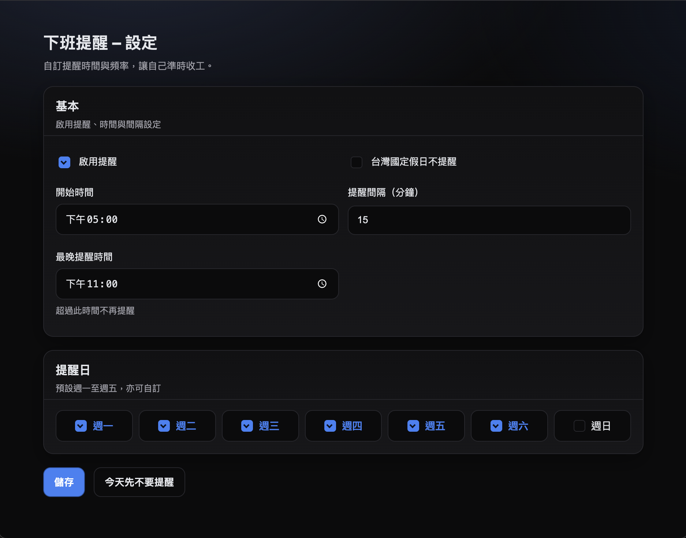

# 您的下班提醒好朋友 （Time To Clock out）


> 一個貼心的小提醒：準時下班，照顧生活與健康。

---

## ✨ 初衷
每天忙於工作時，常常不小心就工作到忘我，等你意識到時，辦公室只剩你。  
**Time To Clock Out** 的設計初衷，就是成為您貼心的好朋友，準時提醒您「收工啦！」，幫助您維持健康的生活節奏，提醒您工作以外，還有生活。

---

## ⚙️ 功能介紹
- **自動提醒**  
  - 預設於 **17:00 後**，每 **15 分鐘**跳出一次通知。
- **自訂設定**  
  - 開始提醒時間  
  - 最晚提醒時間（避免太晚還彈）  
  - 提醒間隔（分鐘）  
  - 提醒日（週一～週日可自選）  
  - 「今日不再提醒／恢復今日提醒」  
- **智慧判斷**  
  - 僅在使用者「活躍中」才提醒（避免 AFK 狀態下打擾）  
  - 自動跳過台灣國定假日（可開關）  

---

## 📂 專案架構
```arduino
time-to-clock-out/
├─ manifest.json        // Chrome Extension 配置
├─ background.js        // 背景邏輯：計時、通知、假日判斷
├─ options.html         // 設定頁
├─ options.js           // 設定頁邏輯
├─ css/
│  └─ options.css       // 設定頁樣式
└─ icons/
   ├─ icon16.png
   ├─ icon32.png
   ├─ icon48.png
   └─ icon128.png
```

---

## 🖥️ 使用指南
1. 安裝後，點擊右上角 **擴充套件圖示** → 打開 **選項**。
    
2. 在「基本設定」中：
   - 勾選「啟用提醒」
   - 設定 **開始時間**、**最晚提醒時間**、**間隔分鐘數**
3. 在「提醒日」勾選想要提醒的星期。
4. 若當日不希望再提醒 → 點「今日不再提醒」按鈕。  
   - 按下後會顯示通知 **「今日不再提醒」**，按鈕文字會變成「恢復今日提醒」  
   - 再次按下可恢復當日提醒，並跳出 **「今日提醒已恢復」**
5. 系統會自動偵測假日（若有啟用），假日時不會彈提醒。

---

## 📥 安裝指南
1. 下載或 clone 此專案：
   ```bash
   git clone https://github.com/jingyieva/time-to-clock-out.git
2. 打開 Chrome，進入：
    ```
    chrome://extensions/
    ```
3. 開啟右上角 開發人員模式。
4. 點選 載入未封裝項目，選擇 time-to-clock-out/ 專案資料夾。
5. 安裝完成後，您會看到綠色小鐘圖示。點擊即可進入設定頁。

---

## 🔒 隱私聲明

Time To Clock out 不會蒐集任何個人資料，所有設定都僅儲存在您的瀏覽器中。

---

## 📌 License

MIT
